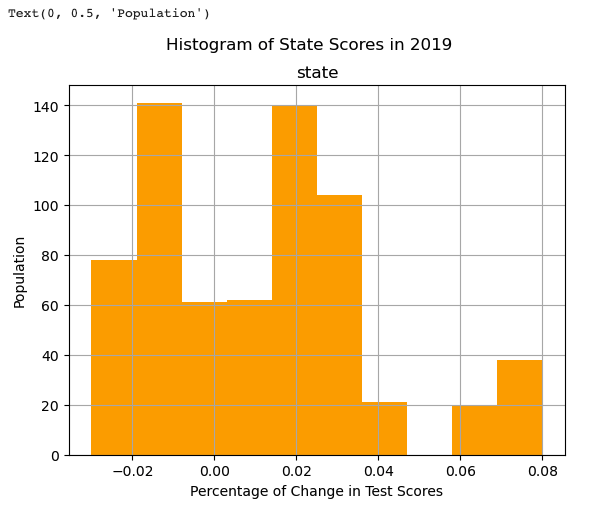

# The Impact on Academic Performance in Harris County TX from 2018 - 2022
This project seeks to analysize the academic progress of students in Harris County Texas in between 2019-2022 (pre- and post- COVID-19). To see our final presentation [click here](https://docs.google.com/presentation/d/1NOg834Tvg7LUZZ1kR1qbmaH5noaO-ygMyaTzDU676KA/edit?usp=sharing).

## Project Overview
COVID-19 had a significant impact on students in the United States. The shift to virtual learning, social distancing requirements, and school closures disrupted the students' academic progress and social development. However, the pandemic's impact was particularly pronounced in the academic growth scores in Harris County, Texas. We wanted to understand if the performance of students in Harris County, TX - the largest county in Texas and the 8th largest county in the United States, was impacted similar to the State of Texas.

In order to analyze this data accurately, we will complete the follow 5 steps:
1. Define questions and goals
2. Collect data
3. Data wrangling
4. Determine analysis
5. Interpret Results

## Questions
Understanding the needs of children learning English in the US is very important in developing lesson plans that strengthen and promote growth. For our project, we came up with three questions to guide our analysis:
- How do economically disadvantaged students perform by district?
- How did the pandemic period impact the test scores of English Learners (EL)?
- How did the pandemic period impact the test scores of multiracial students?

These questions are critical for helping us understand how ELL students develop proficieny over time, how they compare to their counterparts, and how the pandemic impacted their learning.

## Data Collection
### Overview
Originally, we were going to analyze data from one district in Texas; we were encouraged to expand our analysis to the whole state to enrichen our data vizualization and create a robust database. However, we decided to focus only on one county because of time constraints. Long-term, we hope to incorporate all county data in our analysis. Our database includes all schools within Harris County, Texas. 

Stated on their website, "the Texas Education Agency is the state agency that oversees primary and secondary public education...The Texas Education Agency improves outcomes for all public school students in the state by providing leadership, guidance, and support to school systems" (2). The Texas Education Agency uses the State of Texas Assessments of Academic Readiness (STAAR®) program as a metric for measuring the academic growth and improvement of students year over year. Each year, a STAAR report card is published for students administered the assessment.

The STAAR program includes annual assessments for:
- mathematics at grades 3–8
- reading language arts (RLA) at grades 3-8
- science at grades 5 and 8
- social studies at grade 8
- end-of-course (EOC) assessments for Algebra I, English I, English II, Biology, and U.S History

We will only be looking at 2 subjects: mathematics and reading language arts (RLA).

### Database
Out of 20 regions in the state of Texas, we reviewed all 56 schools in Region 4 (Houston). Our database is a compilation of all school districts from grades 3-7. Each school's data were downloaded from the TEA website, reformated, and cleaned using VBA and SQL. 

20 Out of 56 Schools were not included in our database for the following reasons:
- Excluded other grade levels (7)
- Insufficient data or no data at all (7)
- Insufficient or no ELL data (6)

For more information on which schools were left out click the dropdown menu below.

<details close>
<summary>Harris County STAAR Performance for Grade 3-7</summary>
  <br>
<ul><li>A+ Unlimited Potential - Removed because strictly middle school</li>
<li>Academy of Accelerated Learning - https://rptsvr1.tea.texas.gov/cgi/sas/broker?_service=marykay&_program=perfrept.perfmast.sas&_debug=0&lev=D&id=101810&prgopt=reports%2Ftapr%2Fperformance.sas</li>
<li>Accelerated Intermediate Academy - https://rptsvr1.tea.texas.gov/cgi/sas/broker?_service=marykay&_program=perfrept.perfmast.sas&_debug=0&lev=D&id=101849&prgopt=reports%2Ftapr%2Fperformance.sas</li>
<li>Aldine ISD - https://rptsvr1.tea.texas.gov/cgi/sas/broker?_service=marykay&_program=perfrept.perfmast.sas&_debug=0&lev=D&id=101902&prgopt=reports%2Ftapr%2Fperformance.sas</li>
<li>Alief_ISD - https://rptsvr1.tea.texas.gov/cgi/sas/broker?_service=marykay&_program=perfrept.perfmast.sas&_debug=0&lev=D&id=101903&prgopt=reports%2Ftapr%2Fperformance.sas</li>
<li>Alief Montessori Community School - https://rptsvr1.tea.texas.gov/cgi/sas/broker?_service=marykay&_program=perfrept.perfmast.sas&_debug=0&lev=D&id=101815&prgopt=reports%2Ftapr%2Fperformance.sas</li>
<li>Amigos Por Vida Charter School - https://rptsvr1.tea.texas.gov/cgi/sas/broker?_service=marykay&_program=perfrept.perfmast.sas&_debug=0&lev=D&id=101819&prgopt=reports%2Ftapr%2Fperformance.sas</li>
<li>Aristoi Classical Academy - https://rptsvr1.tea.texas.gov/cgi/sas/broker?_service=marykay&_program=perfrept.perfmast.sas&_debug=0&lev=D&id=101803&prgopt=reports%2Ftapr%2Fperformance.sas</li>
<li>Beatrice Mayes Institute Charter School - https://rptsvr1.tea.texas.gov/cgi/sas/broker?_service=marykay&_program=perfrept.perfmast.sas&_debug=0&lev=D&id=101847&prgopt=reports%2Ftapr%2Fperformance.sas</li>
<li>Beta Academy - https://rptsvr1.tea.texas.gov/cgi/sas/broker?_service=marykay&_program=perfrept.perfmast.sas&_debug=0&lev=D&id=101870&prgopt=reports%2Ftapr%2Fperformance.sas</li>
<li>Bloom Academy - Removed data set due to no grade levels beyond Grade 3 and Grade 4</li>
<li>Calvin Nelms Charter School - Removed data set due to no Grade 3 - Grade 5</li>
<li>Channelview ISD - https://rptsvr1.tea.texas.gov/cgi/sas/broker?_service=marykay&_program=perfrept.perfmast.sas&_debug=0&lev=D&id=101905&prgopt=reports%2Ftapr%2Fperformance.sas</li>
<li>Comquest Academt removed due to insufficient data set</li>
<li>Crosby ISD - https://rptsvr1.tea.texas.gov/cgi/sas/broker?_service=marykay&_program=perfrept.perfmast.sas&_debug=0&lev=D&id=101906&prgopt=reports%2Ftapr%2Fperformance.sas</li>
<li>Cypress-Fairbanks ISD - https://rptsvr1.tea.texas.gov/cgi/sas/broker?_service=marykay&_program=perfrept.perfmast.sas&_debug=0&lev=D&id=101907&prgopt=reports%2Ftapr%2Fperformance.sas</li>
<li>Deer Park ISD - https://rptsvr1.tea.texas.gov/cgi/sas/broker?_service=marykay&_program=perfrept.perfmast.sas&_debug=0&lev=D&id=101908&prgopt=reports%2Ftapr%2Fperformance.sas</li>
<li>Draw Academy - removed due to insufficient data set</li>
<li>Elevate Collegiate Charter School - removed due to no data available</li>
<li>Etoile Academy Charter School - removed due to no Grade 3 - Grade 4 Data</li>
<li>Excel Academy - removed due to insufficient data set</li>
<li>Galena Park ISD - https://rptsvr1.tea.texas.gov/cgi/sas/broker?_service=marykay&_program=perfrept.perfmast.sas&_debug=0&lev=D&id=101910&prgopt=reports%2Ftapr%2Fperformance.sas</li>
<li>George I Sanchez Charter - removed due to no Grade 3 - Grade 5 data</li>
<li>Goose Creek CISD - https://rptsvr1.tea.texas.gov/cgi/sas/broker?_service=marykay&_program=perfrept.perfmast.sas&_debug=0&lev=D&id=101911&prgopt=reports%2Ftapr%2Fperformance.sas</li>
<li>Harmony Public Schools North - https://rptsvr1.tea.texas.gov/cgi/sas/broker?_service=marykay&_program=perfrept.perfmast.sas&_debug=0&lev=D&id=101858&prgopt=reports%2Ftapr%2Fperformance.sas</li>
<li>Harmony Public Schools South - https://rptsvr1.tea.texas.gov/cgi/sas/broker?_service=marykay&_program=perfrept.perfmast.sas&_debug=0&lev=D&id=101846&prgopt=reports%2Ftapr%2Fperformance.sas</li>
<li>Harmony Public Schools West - https://rptsvr1.tea.texas.gov/cgi/sas/broker?_service=marykay&_program=perfrept.perfmast.sas&_debug=0&lev=D&id=101862&prgopt=reports%2Ftapr%2Fperformance.sas</li>
<li>Houston Classical Charter - removed due to no data available</li>
<li>Houston Gateway Academy - removed due to insufficient data set</li>
<li>Houston Heights High School - removed due to no Grade 3 - Grade 7 data</li>
<li>Houston ISD - https://rptsvr1.tea.texas.gov/cgi/sas/broker?_service=marykay&_program=perfrept.perfmast.sas&_debug=0&lev=D&id=101912&prgopt=reports%2Ftapr%2Fperformance.sas</li>
<li>Huffman ISD - https://rptsvr1.tea.texas.gov/cgi/sas/broker?_service=marykay&_program=perfrept.perfmast.sas&_debug=0&lev=D&id=101925&prgopt=reports%2Ftapr%2Fperformance.sas</li>
<li>Humble ISD - https://rptsvr1.tea.texas.gov/cgi/sas/broker?_service=marykay&_program=perfrept.perfmast.sas&_debug=0&lev=D&id=101913&prgopt=reports%2Ftapr%2Fperformance.sas</li>
<li>Katy ISD - https://rptsvr1.tea.texas.gov/cgi/sas/broker?_service=marykay&_program=perfrept.perfmast.sas&_debug=0&lev=D&id=101914&prgopt=reports%2Ftapr%2Fperformance.sas</li>
<li>Klein ISD - https://rptsvr1.tea.texas.gov/cgi/sas/broker?_service=marykay&_program=perfrept.perfmast.sas&_debug=0&lev=D&id=101915&prgopt=reports%2Ftapr%2Fperformance.sas</li>
<li>La Porte ISD - https://rptsvr1.tea.texas.gov/cgi/sas/broker?_service=marykay&_program=perfrept.perfmast.sas&_debug=0&lev=D&id=101916&prgopt=reports%2Ftapr%2Fperformance.sas</li>
<li>Legacy School of Sport Sciences - removed due to no ELL data</li>
<li>Meyerpark Elementary - removed due to no ELL data</li>
<li>Pasadena ISD - https://rptsvr1.tea.texas.gov/cgi/sas/broker?_service=marykay&_program=perfrept.perfmast.sas&_debug=0&lev=D&id=101917&prgopt=reports%2Ftapr%2Fperformance.sas</li>
<li>Promise Community School - https://rptsvr1.tea.texas.gov/cgi/sas/broker?_service=marykay&_program=perfrept.perfmast.sas&_debug=0&lev=D&id=101853&prgopt=reports%2Ftapr%2Fperformance.sas</li>
<li>Raul Yzaguirre School for Success - https://rptsvr1.tea.texas.gov/cgi/sas/broker?_service=marykay&_program=perfrept.perfmast.sas&_debug=0&lev=D&id=101806&prgopt=reports%2Ftapr%2Fperformance.sas</li>
<li>Reve Prep Charter School - removed due to insufficient data for ethnicity and ELL</li>
<li>Ser-Ninos Charter School - https://rptsvr1.tea.texas.gov/cgi/sas/broker?_service=marykay&_program=perfrept.perfmast.sas&_debug=0&lev=D&id=101802&prgopt=reports%2Ftapr%2Fperformance.sas</li>
<li>Sheldon ISD - https://rptsvr1.tea.texas.gov/cgi/sas/broker?_service=marykay&_program=perfrept.perfmast.sas&_debug=0&lev=D&id=101924&prgopt=reports%2Ftapr%2Fperformance.sas</li>
<li>Southwest School - https://rptsvr1.tea.texas.gov/cgi/sas/broker?_service=marykay&_program=perfrept.perfmast.sas&_debug=0&lev=D&id=101838&prgopt=reports%2Ftapr%2Fperformance.sas</li>
<li>Spring Branch ISD - https://rptsvr1.tea.texas.gov/cgi/sas/broker?_service=marykay&_program=perfrept.perfmast.sas&_debug=0&lev=D&id=101920&prgopt=reports%2Ftapr%2Fperformance.sas</li>
<li>Spring ISD - https://rptsvr1.tea.texas.gov/cgi/sas/broker?_service=marykay&_program=perfrept.perfmast.sas&_debug=0&lev=D&id=101919&prgopt=reports%2Ftapr%2Fperformance.sas</li>
<li>Step Charter School - https://rptsvr1.tea.texas.gov/cgi/sas/broker?_service=marykay&_program=perfrept.perfmast.sas&_debug=0&lev=D&id=101859&prgopt=reports%2Ftapr%2Fperformance.sas</li>
<li>Lawson Academy - removed due to no ELL data</li>
<li>Pro-Vision Academy - removed due to insufficient ethnicity data</li>
<li>Rhodes School for Performing Arts - removed due to no ELL data</li>
<li>Varnett Public School - https://rptsvr1.tea.texas.gov/cgi/sas/broker?_service=marykay&_program=perfrept.perfmast.sas&_debug=0&lev=D&id=101814&prgopt=reports%2Ftapr%2Fperformance.sas</li>
<li>Tomball ISD - https://rptsvr1.tea.texas.gov/cgi/sas/broker?_service=marykay&_program=perfrept.perfmast.sas&_debug=0&lev=D&id=101921&prgopt=reports%2Ftapr%2Fperformance.sas</li>
<li>Two Dimensions Prep Academy - removed due to no ELL data</li>
<li>Yellowstone College Prep - removed due to no Grade 3 - Grade 4</li>
<li>Yes Prep Schools - https://rptsvr1.tea.texas.gov/cgi/sas/broker?_service=marykay&_program=perfrept.perfmast.sas&_debug=0&lev=D&id=101845&prgopt=reports%2Ftapr%2Fperformance.sas</li></ul>
</details>

## Data Wrangling
Cleaning and preparing the data was by far the hardest and most time consuming section of our project. To cover more ground, we split the group into two sections: Cleaning and Testing. One group was responsible for installing STAAR data for all 36 schools. In the process, they created a macro using VBA to reformat and renamed columns in each xlsx file. Next, they used Postgress (SQL) to combine and store all data sets into one database. The other group focused on testing out the newly cleaned database. They imported CSV files into Jupyter notebook using Python's Pandas library to ensure files were cleaned.

Here is an excerpt of what the data looked like before wrangling.


Because of how complicated our data was, we created a key to help us through the analysis portion of our project. The key highlights specific variables that had the potentional of causing confusion.

Key:
- Mastery - Measures the percentage at which students Approaches Grade Level or Above, Meet Grade Level or Above, and Master Grade Leve
- YoY - Student's academic growth is measured by the difference of the test scores from the prior year and the current year
- Monitored & Former ELL -  Students who were once identified as ELs but have reclassified as English proficient, including students who've been monitored at the state and federal level
- English Learner (EL) - The count and percentage of students whose primary language is not English and who are in the process of acquiring English


For more info on other variables [click here](https://rptsvr1.tea.texas.gov/perfreport/tprs/comprehensive-tprs-glossary-2021.pdf).

Here are some excerpts from the Data Wrangling Phase:

VBA Code used to import, modify, and format data into CSV files
``` VBA
Sub ImportAndFormatXLS()
    'Declare variables
    Dim wb As Workbook
    Dim ws As Worksheet
    Dim rng As Range
    Dim lastCol As Long
    Dim i As Long
    
    'Open the file dialog box to select the XLS file
    Set wb = Workbooks.Open(Filename:=Application.GetOpenFilename("Excel Files (*.xls),*.xls"))
    
    'Set the worksheet variable to the first sheet in the workbook
    Set ws = wb.Worksheets(1)
    
    'Select all cells in the worksheet
    ws.Cells.Select
    
    'Delete the first three rows
    Selection.Rows("1:3").Delete Shift:=xlUp
    
    'Insert a new column A
    ws.Columns("A:A").Insert Shift:=xlToRight
    
    'Determine the last column in the worksheet
    lastCol = ws.Cells(1, ws.Columns.Count).End(xlToLeft).Column
    
    'Loop through every other column starting with column C
    For i = 3 To lastCol Step 2
        'Insert a new column to the right of the current column
        ws.Columns(i + 1).Insert Shift:=xlToRight
    Next i
    
    'Close the workbook without saving changes
    wb.Close SaveChanges:=False
End Sub

```

Pandas we also used to clean the data and matplotlib for data exploration.
```Python
# DATA CLEANING Starr Data 2018-2019 (SA)

# Display the data table for preview
sa1_df.head()

# Find missing values
sa1_df.isnull().sum()

# drop NaNs
sa1_df = sa1_df.dropna()

# change column names
sa1_df.rename(columns={"Primary_Key_2018_2019": "key", "School_Name": "school", "Grade_Test_Type":"grade-sub", "Mastery_Level":"mastery", "Baseline_Year":"baseyr", "Compared_Year":"compyr", "YOY_State_2019":"state", "YOY_Region_2019":"region", "YOY_District_2019":"district", "YOY_African_American_2019":"afriamer", "YoY_Hispanic_2019":"hispan", "YoY_White_2019":"white", "YoY_Econ_Disadv_2019":"edisadv", "YoY_ELL_2019":"ell"}, inplace=True)
sa1_df

# drop base and compared year
sa_df = sa1_df.drop(columns=["key", "baseyr", "compyr"])
sa_df

# drop rows that contain the partial string "Grade 8" and "End of Course"
## sa_df[~sa_df.grade-sub.str.contains("|".join(discard))] - doesn't work
sa_df = sa_df.drop(sa_df[sa_df["grade-sub"].str.contains("8")].index)
sa_df = sa_df.drop(sa_df[sa_df["grade-sub"].str.contains("End")].index)
sa_df
```

SQL to create tables and merge datasets
```PostgreSQL
CREATE TABLE STAAR_Performance_2022_101912(
School_Year Date Not Null,
States int Not Null,
Region int Not Null,
District int Not Null,
African_American int Not Null,
Hispanic int Not Null,
White int Not Null,
American_Indian int Not Null,
Asian int Not NUll,
Pacific_Islander int Not Null,
Two_or_More_Races int Not Null,
Special_Ed_Current int Not Null,
Special_Ed_Former int  Not Null,
Continuously_Enrolled int Not Null,
Non_Continuously_Enrolled int Not Null,
Econ_Disadv int Not Null,
EB_EL_Current_And_Monitored int Not Null,

PRIMARY KEY (District)
--FOREIGN KEY (State_Scores)
);
```

## Data Exploration and Analysis
### Overview
During the exploration phase, we used Matplotlib to explore our database, R/Rstudio for our statistical analysis which showcases the difference and/or similarities between subpopulations. For Machine learning, we used a supervised learning model and a linear regression model algorithm in predicting student scores; and, finally, Tableau to create visualizations that aided our analysis.

Matplotlib was used to show test score changes over three years: 2019, 2021, and 2022.
```Python Matplotlib
# Histogram looking at frequency of increase and/or decrease in state scores
sa_df.hist(column="state", color="orange")
plt.suptitle("Histogram of State Scores in 2019")
plt.xlabel("Percentage of Change in Test Scores")
plt.ylabel("Population")
```



Tableau was also involved in the data exploration phase.

We were able to compare student scores across all zipcodes comprising Harris County.


How did economically disadvantaged students perform by district?
Insert image

The below map is showing data from year 2021-2022
In future studies, we want to see how this progresses and what factors may impact on this performance differences
Explore similarities and differences with other type of population. 


How did the pandemic period impact the test scores of English Learners (ELL)?
insert image

The following bar chart shows that during the pandemic, there was a recess on the academic performance of ELL students
Similarly than the average performance for ELL students in the whole state and students economically disadvantaged
Opposite to that - the years prior and after Covid, the performance was improving over the years


How did the pandemic period impact the test scores of students of different ethnic backgrounds?
insert image

The following bar chart shows that during the pandemic, there was a recess on the academic performance of students of all ethnic backgrounds.
The years prior and after Covid, the performance was improving over the years


## Machine Learning
The final step of this project will involve machine learning and predictive analysis. In this segment, we will use supervised machine learning to make predictions of how scores may look for these student demographics in the coming years. 

### Overview
In this segment, we went through a few different trials to figure out which model would match this data best.
The goal we set out for was to predict the academic progress for students in Harris County Texas in coming years. In a real world situation, this kind of predictive analysis would be useful to school districts and state education departments to make general predictions regarding resources for upcoming school years.
Our first attempt with machine learning was using supervised machine learning. In testing things out, we tried logistic regression and then linear regression. Logistic regression gave us some difficult errors and we ended up realizing that this would be better suited for a binary output, which is not what we were aiming for.
Next, I ran linear regression code, to see if a linear correlation could be found between the two variables that we were comparing. At this time, I was comparing one student demographic, for example English Language Learners (ELL) against school district data. 
I ran this code many times, using different variables, and sometimes having to use different data sets as we narrowed down what we needed. For example, at first, I used a combined dataset to show all data from 2018-2022, but then we realized it would be beneficial to answering our questions for us to see student data specifically from certain school year, such as 2018-2019, 2019-2021, 2021-2022. This way, we could begin to answer our questions around what we can say about student scores in this county, before, during, and “after” the pandemic.

### Results
We found that: 
Comparing to the district meant that the scores were generally very close to one another, which did seem good at first because they had a linear relationship, showing that when one went up, the other went up, and with a few outliers, they were going to probably stay the same. 
So we tried comparing student demographic data to the state measures, which gave a different graphic in the plot. This was less linearly correlated and we didn’t see how this could help answer our questions and make predictions as directly as we wanted the data to.
Comparing student demographics against each other meant that we could see how students would fare in relation to one another. Which could be useful information for looking into the differences in student outcome before, during, and after the pandemic. 
Instead, we saw that this model could help us to predict how these demographic groups of students would do in relation to each other, how similar these groups were. We looked at the year-over-year scores (YOY). In the dataset that combined all years, this shows the difference of scores from 2019-2022, which means that we are looking at the average performance of these groups as a whole over this time period, and that the model uses this data to predict how these groups will do in relation to each other, over the coming years. 
The different student populations that we used the predictive analysis for are: ELL (English Language Learners), african american students, white students, hispanic students, and economically disadvantaged students. 
Initially we made the X value the district data, and y value as the population whose scores we wanted to predict. However, we realized that the output did not give us the visual that we wanted. When we go back to our actual data, it’s the growth of students YOY, not actual scores, and don’t have anything that feeds into score besides demographics. When trying to compare data of district (whole pop) to the district, or to a smaller group, it’s almost like we’re comparing to ourselves. So it was almost redundant, and then we tried to see if demo populations are performing similarly and the only way to do this is to compare against each other. See between 2018-2022, if performing similarly, we see that they are making similar progress and that they have ; only see comparing ELL to hispanic to see if model working because they are mostly same pop in houston. But to compare different groups, ELL to white pop, to see are there correlations between demo groups. Could compare to state to see (taking it out two levels, district-region-state). 
Compared to the state: Were ethnic pops disproportionately impacted by pandemic, hispanic, & african-american; economically disadvantaged, do ELL have neg impact due to virtual learning in 2020? state (theoretically should be all same curriculum, should be best sample size to compare against, and houston being one of the more diverse and large districts/regions are good to compare against state). Is there a correlation? Then that means everyone was affected, but if different for different groups, then means not everyone was proportionately affected. 


### Statistical Analysis with R
In the last moments of this project, we made one final effort to gather some more information that may help us make some predictions of how these students may do in the future. What we saw is that we could create a null hypothesis that compared a certain set of student data to the district or state.
null hypothesis: avg scores among [all african american students]  is equal to the district/state
mu is the district/state average (average of all student data in 18-19 csv)
p - value is greater than 0.05 which means that the null hypothesis can not be rejected…my hypothesis is true – this is the case for african american students vs district data
White students vs state: p = .39 – true
AfrAmer vs State p= .02 – false
Afri amer vs district p = .26 – true
Ell vs state 
18-19: p= much below 0 5.6 e-05 – false
21-22 p= < 2.2e-16 very low false

### Clustering
Clustering is a technique in machine learning that attempts to find clusters of observations within a dataset.
The goal is to find clusters such that the observations within each cluster are similar to each other, while observations in different clusters are quite different from each other.
Clustering is a form of unsupervised learning because we’re attempting to find structure within a dataset rather than predicting the value of some response variable.
K-Means clustering is an unsupervised learning algorithm. There is no labeled data for this clustering, unlike in supervised learning. K-Means performs the division of objects into clusters that share similarities and are dissimilar to the objects belonging to another cluster. The term 'K' is a number. means clustering is an iterative algorithm that selects the cluster centers that minimize the within-cluster variance.


See image
Above is an example of what the vector of a data point and its class membership look like. The point belongs to cluster 3, so it rn3 is 1, the rest are 0. The goal is to find out rnk for all data points.
Objective Function
To train a machine learning model we often look for some sort of error function that we can minimize in order to train our model. In the case of k-means clustering, the goal is to find the cluster centers that minimize the within-cluster variance:

If we minimize the objective function J, we are minimizing the square of the Euclidian distance between the chosen cluster center μ for that cluster.

So for each cluster, we look at the points that we think belong to that cluster, and we choose the cluster center that minimizes the squared of the Euclidian distance between the cluster center and all the points in the cluster. I’ve noted the Euclidian distance as the L2 norm in the image above.
We can take the objective function shown above, differentiate with respect to the cluster centers and equate to 0 to find the cluster centers resulting in the minimum loss (the minimum within cluster variance).


## Conclusion
Generally, Harris County performed at or above state scores 2021-2022. During the pandemic (2020-2021) student and school scores were overall low
District scores were similar to most demographic scores within this time period
ELL student population is very close to Hispanic population in Harris County
Note: ELL students mean students whose home language is not English, so this can mean a lot of things depending on the state you’re in, the student population you’re working with. In a lot of parts of the country, Spanish-speakers tend to make up most of the ELL population. Being in southern Texas, we can safely assume that is the case for Texas and for Harris County. This means that comparing ELL data against Hispanic student data is not going to give us much info since there will be many of the same students in these datasets. 
But it’s important to know that there are many other pieces to the puzzle, anecdotally I’ll mention as a former teacher, that there are many students who are given ELL services whose needs may not be English, but may be academic or psychological, and vice versa. And in other places in the country, like in Queens New York, you will probably find a lot of ELL students whose first languages are Mandarin, Haitian creole, or Arabic.
Going forward, comparing Harris County data to other counties in Texas
School district data can be challenging to work with, since there is not one way that schools across the country record and output academic data. 


## References
1. National Center for Education Statistics. (2022). English Learners in Public Schools. Condition of Education. U.S. Department of Education, Institute of Education Sciences. Retrieved [date], from https://nces.ed.gov/programs/coe/indicator/cgf.
2. About tea. Texas Education Agency. (2022, September 20). Retrieved March 18, 2023, from https://tea.texas.gov/about-tea#:~:text=The%20Texas%20Education%20Agency%20is,and%20support%20to%20school%20systems. 
